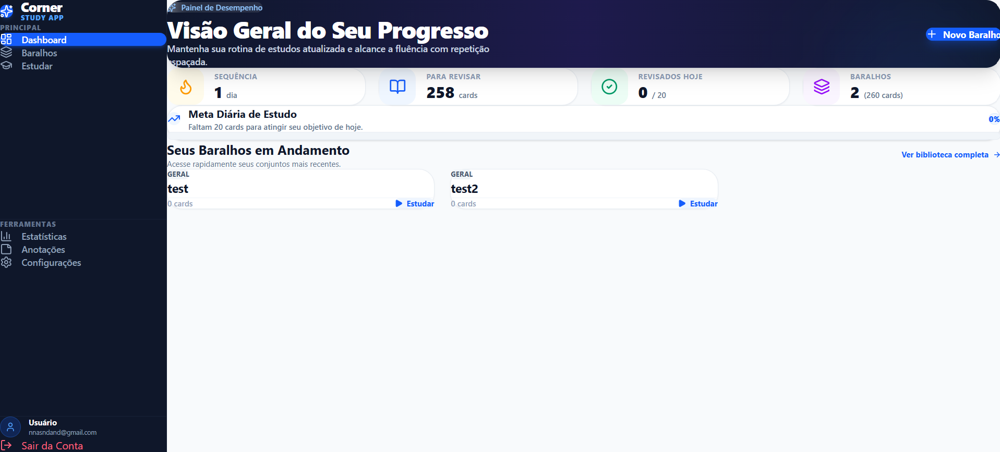
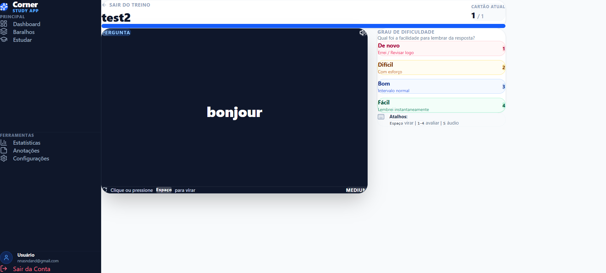
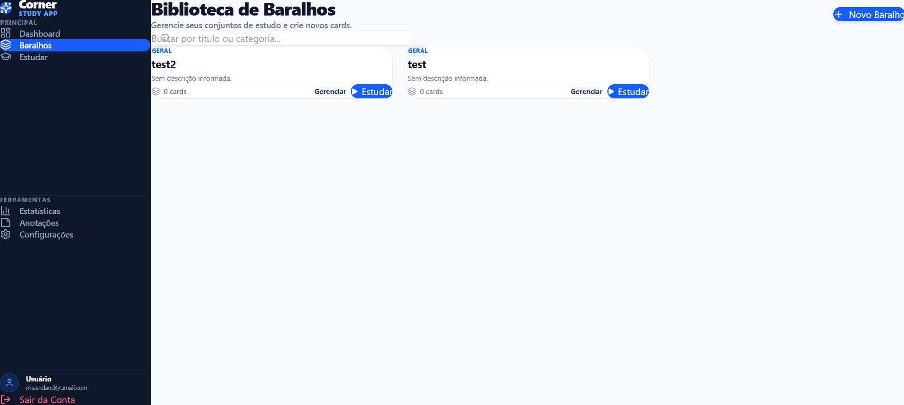
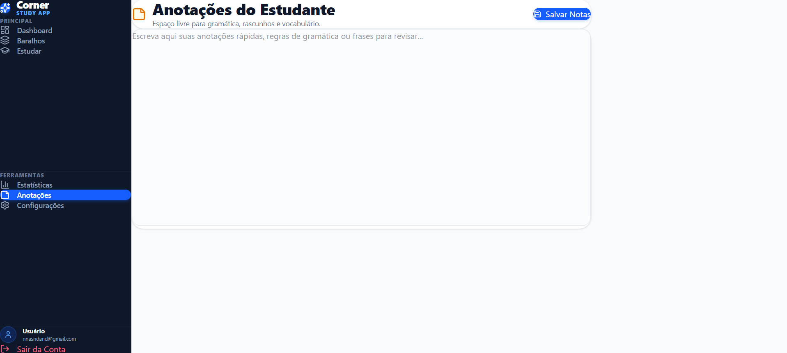
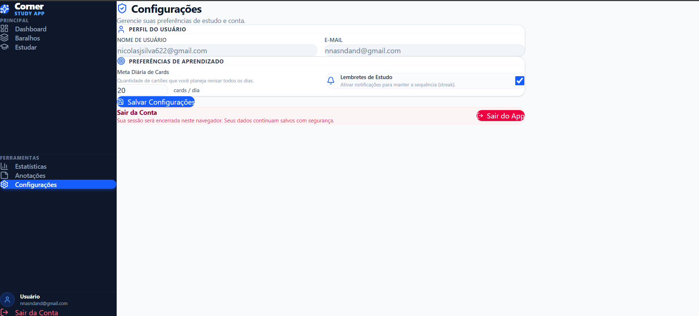

<p align="center">


</p>

# Corner

<div align="center">
  
</div>

Corner is a focused flashcard study application that helps learners manage decks, review cards, and track study momentum through a lightweight spaced-repetition workflow. The project exists to make study sessions easier to organize, easier to revisit, and easier to sustain over time.

At its core, the product follows the spaced repetition learning philosophy: memory strengthens when a concept is revisited just before it is likely to be forgotten. Corner turns that principle into a simple “review, rate, and re-schedule” loop built around deck-based flashcards.

## Current Status

This repository reflects the initial version of Corner. The base experience is already functional and includes the core study workflow, authentication, deck and flashcard management, dashboard insights, and supporting pages. Future releases will continue to expand the app with new additions and planned improvements.

## Features

Corner is a focused flashcard study application that helps learners manage decks, review cards, and track study momentum through a lightweight spaced-repetition workflow. The project exists to make study sessions easier to organize, easier to revisit, and easier to sustain over time.

At its core, the product follows the spaced repetition learning philosophy: memory strengthens when a concept is revisited just before it is likely to be forgotten. Corner turns that principle into a simple “review, rate, and re-schedule” loop built around deck-based flashcards.

## Features

- [x] Authentication with JWT-backed login and registration
- [x] Dashboard with overview metrics and active deck summary
- [x] Flashcard creation, editing, deletion, and import support
- [x] Deck management with title, description, category, and cover image
- [x] Study mode with flip interaction and review buttons
- [x] Progress charts and statistics screens
- [x] Local study notes for quick reference
- [x] Responsive UI with a protected app shell
- [x] Local streak tracking via user study session history
- [x] Search by deck title or category in the deck library page
- [x] CRUD support for cards and decks
- [x] Responsive layout for desktop and smaller viewports

## Screenshots

### Dashboard



### Study flow



### Deck library



### Notes and settings





## Tech Stack

### Frontend

- React 19
- Vite 8
- React Router DOM
- Axios
- Lucide React
- Recharts
- Tailwind CSS 4 via the Vite plugin

### Backend

- Node.js
- Express 5
- Mongoose 9
- JWT authentication
- bcryptjs password hashing
- CORS and cookie-less bearer-token flow

### Database

- MongoDB
- MongoDB Memory Server fallback for local development/testing

### Charts

- Recharts

### Icons

- Lucide React

### Styling

- Tailwind CSS 4 utility classes

### Build tools

- Vite
- ESLint
- Vitest

## Folder Structure

```text
corner/
├── client/
│   └── client/
│       ├── package.json
│       ├── package-lock.json
│       ├── vite.config.js
│       ├── index.html
│       └── src/
│           ├── api/
│           ├── assets/
│           ├── components/
│           ├── context/
│           ├── layout/
│           ├── pages/
│           ├── routes/
│           ├── services/
│           └── utils/
├── server/
│   ├── package.json
│   ├── package-lock.json
│   ├── .env.example
│   └── src/
│       ├── app.js
│       ├── server.js
│       ├── config/
│       ├── controllers/
│       ├── middleware/
│       ├── models/
│       ├── routes/
│       ├── services/
│       └── utils/
└── docs/
```

## Installation

### 1. Clone the repository

```bash
git clone https://github.com/your-org/corner.git
cd corner
```

### 2. Install backend dependencies

```bash
cd server
npm install
```

### 3. Install frontend dependencies

```bash
cd ../client/client
npm install
```

### 4. Run the backend

```bash
cd ../../server
npm run dev
```

### 5. Run the frontend

```bash
cd ../client/client
npm run dev
```

The frontend expects the backend API at `http://localhost:5000/api` by default unless `VITE_API_URL` is provided.

## Environment Variables

### Backend

Create a `.env` file in the backend root using the example in `server/.env.example`.

| Variable | Required | Description |
| --- | --- | --- |
| `PORT` | Yes | Port used by Express. Default is `5000` if omitted. |
| `MONGO_URI` | Yes | MongoDB connection string. Local default is `mongodb://127.0.0.1:27017/corner`. |
| `JWT_SECRET` | Yes | Secret used to sign and verify JWT tokens. |
| `CLIENT_URL` | Optional | Frontend origin used for CORS-related configuration. |

### Frontend

Add the following environment variable in the client environment if you are not using the hardcoded default.

| Variable | Required | Description |
| --- | --- | --- |
| `VITE_API_URL` | Optional | Base API URL for Axios requests, such as `http://localhost:5000/api`. |

## API

The backend exposes these routes under the `/api` prefix.

### Authentication

- `POST /api/auth/register`
  - Body: `username`, `email`, `password`
  - Response: `{ success, data: { token, user } }`

- `POST /api/auth/login`
  - Body: `email`, `password`
  - Response: `{ success, data: { token, user } }`

### Users

- `GET /api/users/me`
  - Protected
  - Returns the current authenticated user profile

- `GET /api/users/dashboard`
  - Protected
  - Returns dashboard stats and the current user’s decks

- `PUT /api/users/settings`
  - Protected
  - Stores settings such as `dailyGoal` and `studyReminders`

- `POST /api/users/study-session`
  - Protected
  - Records the current study-streak update for the user

### Decks

- `POST /api/decks`
  - Protected
  - Creates a deck for the authenticated user

- `GET /api/decks`
  - Protected
  - Returns all decks belonging to the authenticated user

- `PUT /api/decks/:id`
  - Protected
  - Updates the requested deck when it belongs to the current user

- `DELETE /api/decks/:id`
  - Protected
  - Removes a deck and all flashcards inside it

### Flashcards

- `POST /api/flashcards/:deckId`
  - Protected
  - Creates a flashcard inside the selected deck

- `GET /api/flashcards/:deckId`
  - Protected
  - Fetches the flashcards for a deck

- `PUT /api/flashcards/:id`
  - Protected
  - Updates the card and can apply SM-2 review scheduling when a rating is sent

- `DELETE /api/flashcards/:id`
  - Protected
  - Deletes a single flashcard

### Health

- `GET /`
  - Returns a simple API running message

## Project Architecture

### Pages

The client uses route-level pages for the main user journeys:

- `Login` and `Register` for authentication
- `Dashboard` for a consolidated overview
- `Decks` for the deck library experience
- `DeckDetails` for deck editing, card CRUD, and import flows
- `StudyHub` and `Study` for the study session experience
- `Statistics` for summary charts
- `Notes` for a simple freeform study notes editor
- `Settings` for account preferences

### Components

The UI is organized into reusable components for cards, charts, forms, and layout:

- `FlashcardRow` renders a flashcard in the management list
- `StudyCard` is the interactive flipped study card component
- `DeckFormModal` handles deck creation and edit input
- `Sidebar` and `AppLayout` provide the protected app shell

### Services

The frontend keeps API contracts isolated in the service layer:

- `auth.service.js` handles register/login calls
- `deck.service.js` handles deck CRUD requests
- `flashcard.service.js` handles card CRUD and review updates
- `user.service.js` handles user profile, settings, dashboard stats, and study-session tracking

### Context

- `AuthContext.jsx` stores and persists the authenticated user and JWT token in local storage
- `ProtectedRoute.jsx` uses the auth context to block unauthorized access

### Backend

The backend is a lightweight Express API that keeps route handling thin and delegates business logic to service modules. Models define the MongoDB entities for users, decks, and flashcards. The review scheduler logic lives in the backend service layer.

### Database

The application uses MongoDB with these primary collections/entities:

- `User`
  - `username`, `email`, `password`
  - `streak`, `lastStudiedAt`, `dailyGoal`, `studyReminders`

- `Deck`
  - `title`, `description`, `user`, `totalCards`, `lastStudied`

- `Flashcard`
  - `front`, `back`, `tags`, `difficulty`, `deck`
  - `nextReview`, `intervalDays`, `easeFactor`, `reviewCount`

## UI Components

### Cards

- Study cards flip between question and answer.
- Flashcard rows expose edit and delete actions.
- Deck cards summarize card count and study path.

### Buttons

- Navigation and action buttons are implemented with Tailwind utility classes.
- The app uses standard primary and secondary states rather than a central design system component library.

### Charts

- `ActivityChart`, `CategoryChart`, and `ProgressChart` visualize deck and study-related summary information.

### Sidebar

- The sidebar exposes the core app navigation: dashboard, decks, study, statistics, notes, and settings.

### Header

- The app does not currently use a separate header component for protected routes; layout navigation is driven by the sidebar shell.

### Metrics

- Dashboard and statistics screens are composed from direct service responses and chart components.

### Layouts

- `AppLayout` wraps all protected pages in a shared shell.
- The layout has a single, straightforward responsive structure without a more advanced design-system wrapper.

## Future Improvements

The current codebase does not implement the following features yet, but they would be natural follow-ups:

- [ ] AI flashcard generation from notes or PDFs
- [ ] N8N workflow automation for import/export and task orchestration
- [ ] Push notifications or reminder scheduling
- [ ] Progressive Web App support
- [ ] Mobile-first application shell or React Native companion
- [ ] Dark mode
- [ ] Multiplayer study rooms or shared deck collaboration
- [ ] Deeper analytics and retention reports
- [ ] Deck sharing links and public study collections

## Performance

The project is intentionally lightweight and performant because it avoids a large state-management layer, keeps the API layer thin, and uses straightforward React pages with simple service calls. The current build compiles into a small Vite bundle and relies on a direct frontend/service split instead of a heavy abstraction stack.

## Accessibility

Corner already includes several accessibility-friendly patterns:

- Form elements use visible labels and descriptive text.
- The study card component exposes keyboard flip interaction.
- The flashcard study page supports screen-reader-friendly button semantics and includes interactive flip support.
- The layout uses clear contrast with high-visibility surfaces and large touch targets for common actions.

## Author

Nicolas de Jesu Silva

## License

MIT
